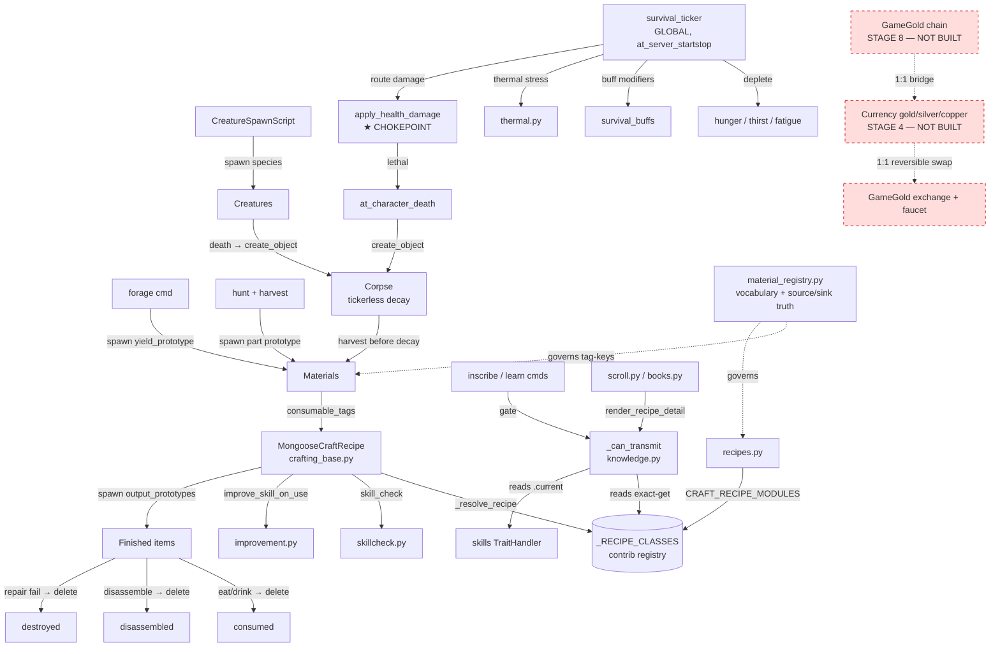

# PolishedWorld — System Map

> **Rev 1 · 2026-07-19** — first version. Structural (seam) view of how the built systems connect; a fourth view alongside the three altitudes.
> **Canonical:** `docs/PolishedWorld_System_Map.md` @ G0dlet/PolishedWorld — git wins. If a project-knowledge copy's Rev is lower than the repo's, it's stale.

## What this is (and what it is not)

A **structural cross-section**: how the systems that exist *today* wire into each
other, and where the load-bearing seams are. It answers *"if I touch X, what
else moves?"* and *"what is missing / dangling?"*.

It is a **fourth view** alongside the three altitudes, on a different axis:

| Doc | Axis | Answers |
|---|---|---|
| `roadmap.md` | temporal | what's next, in what order |
| `*_Decomposition.md` | tactical | how to build one feature, task by task |
| `*_Evennia_Reference.md` | reference | how a contrib/API behaves |
| **this** | **structural** | **how the built systems connect right now** |

**Scope rule (keeps it from rotting into a lie):** describe only what is *built*.
Future systems (currency, magic, GameGold) appear **only** as dangling edges
marked `NOT BUILT`, never as if they exist.

## How to keep it honest (grep-verifiable)

Every seam below names a real symbol + file. To check a row hasn't gone stale:

```bash
grep -rn "_can_transmit" world/ commands/ typeclasses/
```

If the grep result no longer matches the "Consumers" column, the row is stale —
fix the row in the same commit (bump Rev). Same discipline `AGENTS.md` already
imposes on generated data.

---

## The map



---

## Load-bearing seams

The precise, grep-checkable contracts. These are the edges that, if broken,
break more than one system.

| Seam | Symbol | Defined in | Consumers (grep target) | Contract |
|---|---|---|---|---|
| Knowledge gate | `_can_transmit(char, name)` | `world/knowledge.py` | `commands/crafting_commands.py` | know-recipe AND permanent `craft.current ≥ min_skill`; no roll |
| Recipe registry | `_RECIPE_CLASSES` / `_load_recipes()` | `evennia.contrib…crafting.crafting` | `crafting_base.py`, `crafting_commands.py`, `knowledge.py`, `typeclasses/books.py` | exact `.get(name)`, None-guarded; **3rd+ consumer — logged once in BACKLOG** |
| Recipe module load | `CRAFT_RECIPE_MODULES` | `server/conf/settings.py` | `world/recipes.py` | concrete recipes only; **`crafting_base.py` must NOT be listed** (phantom-registration trap) |
| Craft engine | `MongooseCraftRecipe` | `world/crafting_base.py` | `world/recipes.py` (subclass) | `pre_craft` gates (min_skill, requires_knowledge) → `do_craft` (roll→quality→spawn) → `post_craft` (consume) |
| Material vocabulary | `MATERIALS`, `by_status()`, `orphan_materials()` | `world/material_registry.py` | recipes, repair, validator | one tag-key per concept; source/sinks/status per entry |
| Damage chokepoint | `apply_health_damage(amount, source)` | `typeclasses/characters.py` | `survival_ticker.py`, (future: combat) | single route to death → one corpse per lethal event |
| Global survival tick | `deplete_all_survival_traits()` | `world/survival_ticker.py` | `server/conf/at_server_startstop.py` | picklable module-level callback; iterates puppeted sessions, dedupes multisession |
| Skill improvement | `improve_skill_on_use` | `world/improvement.py` | craft, repair, hunt-attack, hunt-harvest | reads/writes `.current` (permanent), not `.value` |

★ = single point of failure worth guarding with extra care.

---

## Known gaps / dangling edges

*(This is the "what's missing" section — the reason the doc exists. The material
layer's gaps are tracked in code and enumerated in
`docs/crafting/PolishedWorld_System_Backlog.md` (the 14 unbuilt systems, in build
order) — the `BLOCKED` cluster in the graph above is the shorthand for that
chain: smelting → smithing → steelmaking, kiln → charcoal/pottery, etc. The
finished-goods side and the `[SINK BLOCKED]` items live in the Source/Sink
Ledger.)*

- **Currency node is dangling.** No gold/silver/copper in the repo (Stage 4).
  Every coin-priced feature (teaching-for-pay, recipe buy/sell) currently routes
  through **barter only**. GameGold (Stage 8) is *defined* 1:1 with a currency
  that does not yet exist → hard sequencing edge.
- **Currency is a single-mint, pegged currency board** — source/sink owned by the
  economy docs (`PolishedWorld_Economic_Philosophy.md` principles 4–5,
  `PolishedWorld_GameGold_Economy.md`), not this map. Gold mints at *one* point
  (crypto_exchange); the faucet redistributes, never mints. **One true exit:**
  exchange back to GameGold — gold never decays, so on death it drops to the room
  and waits until looted. Circulation — repairs, fees, rent, a rival looting your
  corpse — is *not* a sink; it's another player's income.
- **Knowledge has no sink.** `learn_recipe` is permanent; nothing un-learns.
  Intentional today, noted so it isn't mistaken for an omission.
- **Two independent tickers** (`survival_ticker`, `garment_wear`) — verify they
  never double-touch the same object per tick if a third is added.
