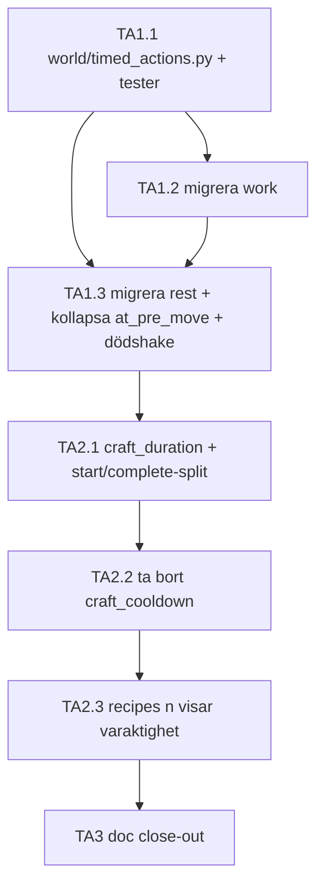

# PolishedWorld — Timed Actions Decomposition (Epic A)

> **Rev 1 · 2026-09-09** — first version. Written after Stage 4.5 merged to `main`, against live source read the same day (`typeclasses/characters.py`, `commands/work_commands.py`, `commands/consumption_commands.py`, `commands/crafting_commands.py`, `world/crafting_base.py`, `world/recipes.py`, `world/knowledge.py`, and Evennia `CmdCraft` at the pinned `v6.1.0` tag). Locks decisions D1–D7 from the 2026-09-09 planning session, which existed only in chat until this file. **This document is also what defines "Epic A"** — the name is already cited as an ordering dependency by `docs/roadmap.md` (food professions: *"after Epic A"*) and by `docs/BACKLOG.md` (*two-stage healing*, whose Trigger and Status both name Epic A's `world/timed_actions.py`), and until this file lands it is cited but undefined.
> **Canonical:** `docs/PolishedWorld_Timed_Actions_Decomposition.md` @ G0dlet/PolishedWorld — git wins. If this project-knowledge copy's Rev is lower than the repo's, it's stale — re-upload from the repo.

**Feature branch:** `feature/timed-actions`
**Status:** planned — no code written
**Rough scope:** 5–6 commits, 2–3 sessions
**Philosophy:** skynda långsamt — extrahera mönstret från två fungerande implementationer *innan* den tredje skrivs för hand.

---

## 1. Varför den här epiken

Två backlog-poster pekar på samma pass och är korsrefererade från båda håll:

- ***Timed player actions have a pattern but no shared home*** (Tooling & Process) — `rest` och `work` implementerar "det här tar tid och kan avbrytas" var för sig. `at_pre_move` bär två handskrivna grenar och växer med en per framtida handling. Trigger: **Met (Rev 24)**.
- ***Crafting resolves instantly*** (Crafting & Tools) — `craft` är den **tredje** timade handlingen, och den som fyrade av triggern ovan. Trigger: **After Stage 4.5 Component D** (uppfyllt 2026-08-24).

Posterna säger uttryckligen: gör båda i ett pass. Att bygga craft-duration ensamt vore att skriva en fjärde `at_pre_move`-gren, vilket är precis det utfall den första posten finns för att förhindra.

Epiken har också konsumenter som redan väntar: `docs/roadmap.md`s **food professions** sekvenserar sig *efter* den här (plantera/skörda är timade handlingar), och `docs/BACKLOG.md`s **two-stage healing** listar `world/timed_actions.py` som en av två triggers (kirurgi är avbrytbar per konstruktion). Den här epiken är alltså inte städning — den är infrastruktur två framtida system redan är designade mot.

---

## 2. Designbeslut låsta 2026-09-09 (D1–D7)

| # | Beslut | Val | Konsekvens |
|---|--------|-----|------------|
| D1 | Hjälparens form | **Modul med rena funktioner** — `world/timed_actions.py`, **en** slot `ndb.timed_action` | Speglar `_finish_task`-mönstret (direkt anropbar från test), håller `Character` tunn, och **en** slot ger **en** `at_pre_move`-gren — hela poängen med posten. |
| D2 | `rest` | **Migreras** till sloten, behåller sin tick-loop | Annars kvarstår två grenar och posten är inte stängd. `ndb.resting` och `ndb.working` försvinner helt. |
| D3 | Ömsesidig uteslutning | **Alltid explicit**, aldrig tyst avbrott | En regel att lära sig. Meddelandet namnger pågående handling; `rest` är en toggle (verifierat) så det finns ett rent avslut att peka på. |
| D4 | `craft_duration` | **Ersätter `craft_cooldown` helt** | Två rattar med samma observerbara effekt går inte att kalibrera i efterhand — samma argument som frös `improvement_cooldown` på 30 i Stage 4.5. |
| D5 | Start vs. slutförande | **Artighetskoll vid start, contribens omsökning vid slutförande är den som räknas** | `work`-docstringens formulering, oförändrad: för-kontrollen är artighet, efter-kontrollen är korrekthet. |
| D6 | Callbackens hemvist | **Modulnivå-`_complete_craft(cmd, marker)`** som tar Command-instansen | `super().func()` läser `self.recipe/ingredients/tools` från ärvd `parse()`; alternativet är att återuppfinna contribens sökning. |
| D7 | Avbrott | **v1: rörelse enda avbrottet**, `persistent=False`, + `at_character_death()` anropar `interrupt()` | ndb och delay dör tillsammans vid `@reload`; inget konsumeras. Dödshaken är städning, inte en ny abort-källa. |

**Följdbeslut från samma session:** `recipes <n>` visar varaktighet (Q3, ja) · inget nytt rumsmeddelande vid slutförande (Q4, nej i v1 — startmeddelande till rum som `work`, contribens befintliga utdata går till hantverkaren) · skill-skalad varaktighet **uteslutet ur v1** (backlog-posten säger det: det interagerar med 4.5 C/D:s practice-line).

### Namngivning
Epiken heter **Epic A** i två dokument på `main`. Komponenterna här heter därför **TA1–TA3**, inte A–C: "Epic A, Component A" är oläsbart, och Hunting-decompen har redan precedens för prefixade komponenter (H1–H7). Mappning till planeringssessionens skiss: TA1 = A, TA2 = B, TA3 = C.

---

## 3. Verifierade källankare (source-first, läst mot `main` 2026-09-09)

- `typeclasses/characters.py`
  - `rest_interval = 10`, `rest_recovery = 5` (klassattribut).
  - `start_resting()` / `stop_resting(reason=...)` / `_rest_tick()`. Ticken **schemalägger sig själv** via `delay(self.rest_interval, self._rest_tick)` och bevakar `ndb.resting` + `has_account`.
  - `at_pre_move(destination, move_type="move", **kwargs)` — två grenar, returnerar `super().at_pre_move(...)`.
  - `at_character_death(killer=None)` — `ndb._dying`-reentrancy-guard i `try/finally`.
  - `at_post_unpuppet()` kallar **inte** `super()`; kroppen står kvar i rummet (statue logout). **Detta är hela skälet till att `has_account` vaktar varje callback** — annars betalar/tickar världen till en obemannad kropp.
- `commands/work_commands.py`
  - Modulnivå-`_finish_task(caller, task_key, marker)`; `marker = object()`; guards `not caller.pk or caller.ndb.working is not marker`, sedan `has_account`, sedan `_temple_here()`-omkoll.
  - `delay(task["duration"], _finish_task, caller, task_key, marker)`, `persistent=False` **som beslut** (dokumenterat i modul-docstringen).
  - Modul-docstringen beskriver `ndb.working` explicit → **blir falsk efter TA1.2**.
- `commands/consumption_commands.py` — `CmdRest` (key `rest`, help_category `survival`) är en **toggle**: `if caller.ndb.resting: caller.stop_resting()` annars `start_resting()`. Hjälptexten säger redan "Use 'rest' again, or move, to stop."
- `commands/crafting_commands.py` — `CmdCraftGated(CmdCraft)` överlagrar **bara** `func()`, gör kunskaps-early-reject och avslutar med `super().func()`. `key`/`locks`/`parse` ärvs.
- Evennia `v6.1.0` `CmdCraft` — `parse()` sätter `self.recipe/ingredients/tools`; `func()` söker ingredienser i inventariet, verktyg var som helst, och anropar `craft(caller, self.recipe, *(tools + ingredients))`, därefter `obj.location = caller`.
- `world/crafting_base.py` — `craft_cooldown = 30` (klassattribut), `_cooldown_key` (property), gate i `pre_craft` **efter** kunskaps- och skill-gaten, `cooldowns.add(...)` överst i `do_craft` efter `rolled = True`. Modul-docstringen rad ~9/11/21/25 beskriver kooldownen → **blir falsk efter TA2.2**.
- `world/recipes.py` — åtta subklasser med explicita värden (20/25/30/40/45). Modul-docstringen rad ~6 säger "cooldown sink" → **blir falsk efter TA2.2**.
- `world/knowledge.py` — `render_recipe_detail(cls)` är ren presentation och **delas** av `CmdRecipes` (C.2) och scroll-`look` (F.3). En ändring, två ytor.
- `AGENTS.md` §0A — `tests/test_knowledge.py` är golden reference; `evennia test --settings settings.py .`; baslinje **429 tester gröna** (roadmap Rev 19).
- Mekanismen: `evennia.utils.utils.delay` — `PolishedWorld_Evennia_Reference.md` §11.27.

---

## 4. API — `world/timed_actions.py`

```python
start(char, key, seconds, callback, *args, label=None, interrupt_msg=None, on_interrupt=None) -> marker | None
is_busy(char) -> record | None       # record.label driver D3:s meddelande
is_current(char, marker) -> bool     # ICKE-destruktiv: för repeterande tickar (rest)
claim(char, marker) -> bool          # destruktiv: för engångsslut (work, craft)
interrupt(char, reason=None) -> bool # rensar sloten, meddelar, kör on_interrupt
```

**`is_current` vs. `claim` är inte kosmetik.** `work` och `craft` är engångs — deras callback tar sloten och lämnar den tom. `rest` tickar om och om igen och måste kunna fråga "är jag fortfarande den aktuella handlingen?" **utan** att nolla sloten, annars avslutar första ticken vilan. Skissen från planeringssessionen hade bara `claim`; det hade gått sönder på D2:s migrering. Båda vaktar `caller.pk`, markör-identitet och `has_account`.

`on_interrupt` finns för `rest`s rumsmeddelande ("gets up") — actor-meddelandet räcker inte, vila har en publik dimension. Recordet bär markör, nyckel, label och de två meddelandena.

**Ingen `_format_wait`-import.** Den bor i `commands/work_commands.py` och `world/` importerar inte från `commands/`. Craft-varaktigheter är sekunder och renderas som `Ns`. (`_format_wait`s trunkeringsdefekt har en egen backlog-post och rörs inte här.)

---

## 5. Beroendegraf



TA1.3 efter TA1.2 för att `at_pre_move` ska kunna kollapsa till **en** gren i ett enda commit i stället för att redigeras två gånger.

---

## 6. Component TA1 — Delad timed-action-modul

### Task TA1.1 — `world/timed_actions.py` + `tests/test_timed_actions.py`
- **Goal:** En slot, fem funktioner, inga beroenden uppåt mot `commands/` eller `typeclasses/`.
- **Dependencies:** Inga (ren modul + `evennia.utils.utils.delay`).
- **Approach (key shape):**
  ```python
  # world/timed_actions.py
  from evennia.utils.utils import delay

  class _Record:
      """In-memory only. Dies with the process, exactly like the delay it pairs with."""
      __slots__ = ("marker", "key", "label", "interrupt_msg", "on_interrupt")

  def start(char, key, seconds, callback, *args,
            label=None, interrupt_msg=None, on_interrupt=None):
      if is_busy(char):
          return None                      # caller messages; D3 = explicit
      marker = object()                    # identity token; cannot collide
      char.ndb.timed_action = _Record(...)
      delay(seconds, callback, char, *args, marker)   # persistent=False (default)
      return marker
  ```
- **Multiplayer:** ndb är per objekt, reaktorn enkeltrådad → ingen delad state, ingen race. Sloten är per karaktär, aldrig global.
- **Test:** andra `start` returnerar `None` medan upptagen · `interrupt` rensar + meddelar + kör `on_interrupt` · stale markör vägras av både `claim` och `is_current` (walk-away-och-starta-om: första callbacken får **inte** landa på andra försöket) · `claim` rensar sloten, `is_current` gör det inte · `has_account=False` vägras. `delay` mockas för att fånga callbacken; funktionerna anropas direkt.
- **Mutationstest:** ta bort identitetskollen → walk-away-testet **måste** falla. Ett test som passerar utan den vaktar ingenting.
- **Commit:** `feat(timed): add shared timed-action slot in world/timed_actions.py`

### Task TA1.2 — Migrera `work` till sloten
- **Goal:** `work` använder hjälparen; `ndb.working` finns inte längre.
- **Dependencies:** TA1.1.
- **Approach:** `_finish_task` byter `if not caller.pk or caller.ndb.working is not marker: return` mot `if not timed_actions.claim(caller, marker): return` (som redan omfattar `pk` och `has_account`). Startvägen byter `if caller.ndb.working:` + manuell markör mot `start(..., label="working", interrupt_msg="You break off what you were doing.")`. **Kooldownregeln rörs inte:** `cooldowns.add()` sitter kvar efter en lyckad `transfer_to()` och ingen annanstans — allt-eller-inget-regeln är låst och den här migreringen är rent mekanisk. `at_pre_move`s `working`-gren tas bort. Modul-docstringens hazard-lista (punkt 1–4) uppdateras till att beskriva sloten.
- **Test:** befintlig `work`-regression grön + nytt test att `rest` under pågående chore vägras med labeln.
- **Commit:** `refactor(work): move temple chores onto the shared timed-action slot`

### Task TA1.3 — Migrera `rest`, kollapsa `at_pre_move`, dödshake
- **Goal:** En `at_pre_move`-gren totalt; `ndb.resting` finns inte längre.
- **Dependencies:** TA1.2.
- **Approach:** `start_resting()` anropar `start(..., label="resting", interrupt_msg="You get up, interrupting your rest.", on_interrupt=<rummets "gets up">)` och behåller `delay(self.rest_interval, self._rest_tick)`. `_rest_tick` byter `if not self.ndb.resting or not self.has_account` mot `is_current(self, marker)`; markören når ticken via `delay(..., marker)`. `stop_resting(reason)` blir en tunn wrapper över `interrupt`. `CmdRest`-toggeln läser `is_busy` — **och måste skilja på "vilar" och "gör något annat"**: `rest` under en craft ska ge D3-meddelandet, inte tyst avbryta craften. `at_pre_move` blir:
  ```python
  def at_pre_move(self, destination, move_type="move", **kwargs):
      timed_actions.interrupt(self)      # no-op when idle; messages when not
      return super().at_pre_move(destination, move_type=move_type, **kwargs)
  ```
  `at_character_death()` får `timed_actions.interrupt(self)` inuti `try` (D7). Ordning: före corpse-spawn, så en pågående handling aldrig ser en halvflyttad karaktär.
- **Test:** vila tickar till full · rörelse avbryter med rätt meddelande + rumsmeddelande · `rest` under craft ger busy, avbryter inte · död rensar sloten · `has_account`-guard behållen (statue logout).
- **Commit:** `refactor(rest): move resting onto the shared slot; collapse at_pre_move to one branch`

---

## 7. Component TA2 — Craft duration

**Commit-ordningen är avsiktlig och omvänd mot planeringsskissen.** Att döpa om/ta bort `craft_cooldown` *först* skulle lämna ett commit där craft varken har kooldown eller varaktighet — helt ostrypt. Att lägga till varaktigheten först lämnar i stället ett commit med **dubbel** strypning (varaktighet + kvarvarande kooldown), vilket är strikt säkrare och gör borttagningen trivialt granskbar. Mellanläget är ett branch-tillstånd, aldrig ett merge-tillstånd.

### Task TA2.1 — `craft_duration` + start/complete-split
- **Goal:** `craft` väntar innan den löser sig; hela `collect → roll → consume` landar i en tick vid slutförandet.
- **Dependencies:** TA1.1 (TA1.3 för att undvika en tredje `at_pre_move`-redigering).
- **Approach:** `craft_duration = 30` på `MongooseCraftRecipe`; `world/recipes.py` får `craft_duration` med samma värden (mekanisk ändring — **vi** gör den, inte OpenCode: `world/recipes.py` ligger i AGENTS §0-scope men det här är en logikflytt, inte data). `CmdCraftGated.func()` splittas:
  ```python
  def func(self):
      # ... befintlig usage-check + kunskaps-early-reject (oförändrad) ...
      if timed_actions.is_busy(caller):
          caller.msg(...)                       # D3
          return
      # D5: artighetskoll -- caller.search(..., quiet=True), inget tillstånd rörs
      marker = timed_actions.start(caller, "craft", cls.craft_duration,
                                   _complete_craft, self, label="crafting", ...)

  def _complete_craft(caller, cmd, marker):     # module level, D6
      if not timed_actions.claim(caller, marker):
          return
      super(CmdCraftGated, cmd).func()          # contriben söker om, gates, roll, consume
  ```
- **Multiplayer:** en Command-instans lever under fördröjningen (medvetet, D6) — per spelare, inte delad. Ingen check-här-commit-där: **inget** tillstånd läses vid start som fattar beslut vid slutförande.
- **Test:** inget konsumeras vid start · ingrediens borttappad under craften → contribens fel vid slutförande, noll konsumtion · rörelse under craft → avbrottsmeddelande, delay fyras tyst, ingen produkt · `work` under craft → busy.
- **Commit:** `feat(craft): make crafting take time via the shared timed-action slot`

### Task TA2.2 — Ta bort `craft_cooldown`
- **Goal:** En ratt, inte två.
- **Dependencies:** TA2.1.
- **Approach:** ta bort kooldown-gaten ur `pre_craft`, `cooldowns.add()` ur `do_craft`, `_cooldown_key` ur klassen, `craft_cooldown` ur båda filerna. `improvement_cooldown = 30` rörs **inte**.
- **Commit:** `refactor(craft): remove craft_cooldown, superseded by craft_duration`

### Task TA2.3 — `recipes <n>` visar varaktighet (Q3)
- **Goal:** Tiden är synlig innan man binder upp sig.
- **Approach:** `render_recipe_detail` får en `Time:`-rad bredvid `Skill:`. Delad renderare → `recipes <n>` och `look <scroll>` uppdateras samtidigt, vilket är hela skälet den delas.
- **Commit:** `feat(recipes): show craft duration in the recipe detail view`

---

## 8. Component TA3 — Doc close-out

- `docs/BACKLOG.md`: båda posterna **OPEN → DONE** med Rev-rad.
- `docs/roadmap.md`: **definiera Epic A** i parallel-backloggen (den citeras redan av food professions och av two-stage healing) och notera att den är levererad. Se §11.
- `docs/PolishedWorld_Evennia_Reference.md` §11.27: den delade sloten som det kanoniska mönstret.
- `docs/PolishedWorld_Testing_Reference.md`: bara om körningen producerar en ny fälla (mock-av-`delay`-idiomet är en kandidat).
- **Falska docstrings som blir falska av det här arbetet** — ersätts på plats, inte i efterhand: `commands/work_commands.py` modul-docstring (beskriver `ndb.working`), `world/crafting_base.py` rad ~9/11/21/25, `world/recipes.py` rad ~6 ("cooldown sink").

**Commit:** `docs: close out Epic A (timed actions) across backlog, roadmap and references`

---

## 9. Konsekvenser värda att läsa två gånger

**Parallellitet försvinner.** Per-recept-kooldownnycklar tillät att man craftade twine medan waterskin-kooldownen löpte. Sloten serialiserar allt. Genomströmningen för *ett* recept är oförändrad (45 s före i stället för 45 s efter), men den som körde två recept omlott märker en reell nedgång. Avsiktligt — en handling i taget är hela poängen — men det är en spelbar förändring, inte bara en refaktor.

**Kortaste craften understiger XP-kooldownen.** `craft_duration = 20` mot `improvement_cooldown = 30`: twine-spam bromsas nu av XP-kooldownen, inte av crafttiden. Ingen åtgärd — 30 är fryst som väggklocksgolv sedan Stage 4.5 — men det är första gången de två talen korsar varandra.

**`rest` och `work` blir ömsesidigt uteslutande**, vilket de inte är idag. Det är D3 och det är avsiktligt, men det är en beteendeändring för `rest`, inte bara för craft.

---

## 10. Öppna frågor / risker

- **Skill-skalad varaktighet** — uttryckligen ur v1 (interagerar med 4.5 C/D:s practice-line). Backlog-post om den efterfrågas.
- **Craft-abort ⇒ ingen kostnad alls.** Avbryt vid sekund 29 av 30 kostar ingenting. Med kooldownen borttagen finns inget spam-golv under `craft`-kommandot självt. Troligen rätt (allt-eller-inget, samma som `work`s payout-regel), men det är ett balansval som bör mätas när recept-katalogen finns.
- **`ndb._dying` migreras inte.** Det är en reentrancy-guard, inte en timad handling. Att dra in den i sloten vore att göra hjälparen till en generisk flagg-butik.
- **Fjärde konsumenten.** Food professions (plantera/skörda) och two-stage healing (kirurgi) är redan designade mot den här sloten. Om någon av dem behöver *köade* eller *samtidiga* handlingar bryter en-slot-modellen — då är det ett medvetet API-beslut, inte en tyst tillägg av en andra ndb-flagga.

---

## 11. Vad det här dokumentet inte fixar (doc-skuld hittad 2026-09-09)

Tre saker på `main` som inte hör hemma i den här epiken men som hittades när den skrevs:

1. **Stage 4.5:s merge till `main` är inte bokförd.** Rev 19 säger "delivered on `feature/skill-progression`"; ingen Rev säger att den är på `main`. Precedens finns och är explicit: Rev 11 skrev "merge to `main` pending", Rev 12 skrev "Stage 4 merged to `main` (PR #14, `02d1807`)". Dessutom saknas Stage 4.5 i listan **"✅ Numbered stages — all merged on `main`"**, och Mermaid-noden `S45` saknar den `✅` som S1–S4 bär — vilket betyder att scan-the-headings-vyn, den enda någon faktiskt använder, visar 4.5 som öppen. Det är exakt felet Rev 11 dokumenterade om Stage 3 och Rev 12 generaliserade till fyra ställen till.
2. **"Epic A" citeras av två dokument och definieras av inget.** Den här filen är det avsedda svaret, men roadmapens parallel-backlog behöver posten som pekar hit.
3. **De två backlog-posterna bär inte namnet "Epic A"** och inte heller D1–D7. Tills TA3 körs är de låsta besluten odokumenterade på `main`.
