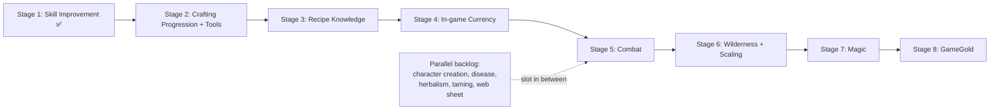

# PolishedWorld — Strategic Roadmap

> **Rev 3 · 2026-07-10** — Stage 2 (Crafting progression & tools) **underway** on `feature/crafting-progression`: Components A (tool-modifier flip), B (shared `condition` durability axis), and C (tool bootstrap — `Tool` typeclass, stone/stick primitives + nodes, stone-knife & bone-needle recipes) complete & in-game-verified. The zero-to-tool loop is playtestable both ways (forage→stone knife, hunt→bone→bone needle). Remaining Stage 2: D (tool wear sink) → E (quality→capability) → F (skill-gate) → G (superior-tool scaling). Tactical detail in `PolishedWorld_Crafting_Progression_Decomposition.md` (Rev 3).
> **Rev 2 · 2026-07-10** — Stage 1 (Skill Improvement) **complete & in-game-verified** on `feature/skill-improvement`: primitive → gated trigger → felt-progress (tick-feedback + desc-tier celebration + `progress` command). Resolves the skill-improvement pacing/display open question (raw % is the single mechanical truth, surfaced via on-use ticks + desc-tier-crossing celebration, no 1–99 badge). Hunting (Stage 0) merged to `main`. **Critical-path reorder:** the two crafting-economy epics that cash in Stage 1 are promoted out of the backlog ahead of currency — new order S2 Crafting progression & tools → S3 Recipe knowledge & discovery → S4 In-game currency → S5 Combat → S6 Wilderness → S7 Magic → S8 GameGold (later stages renumbered +2).
> **Rev 1 · 2026-07-01** — initial strategic roadmap: felt-progress + legibility (Stage 1), recipe-knowledge economy epic, search/disambiguation UX item, full decision log.
> **Canonical:** `docs/roadmap.md` @ G0dlet/PolishedWorld — git wins. If this project-knowledge copy's Rev is lower than the repo's, it's stale — re-upload from the repo.

> **Supersedes** `PolishedWorld_Implementation_Plan.md` (retired — its content is fully implemented/merged).
> This document operates at **epic/milestone altitude**: *what we tackle next and why, in which order*.
> It deliberately contains **no tasks, no code, no `@py` tests** — those live in per-feature decomposition docs.

---

## How this document relates to the others

PolishedWorld has three planning altitudes. Keep them distinct to avoid drift:

| Altitude | Document(s) | Answers | Updated when |
|---|---|---|---|
| **Strategic** | *this file* | What's next, why, in what order | An epic starts/finishes or sequencing changes |
| **Tactical** | `*_Decomposition.md` (e.g. hunting, skill improvement) | How to build one feature, task by task | During a feature's design session |
| **Reference** | `*_Evennia_Reference.md`, `*_Mongoose_Legend.md`, `*_Code_Standards.md`, `GameGold_*` | Hard-won facts, gotchas, rules | As learnings accrue |

**Workflow per epic:** when an epic comes off this roadmap, run *one* design/source-verification session → produce a decomposition doc → implement task-by-task. This file then marks the epic Done.

---

## North star (design pillars the roadmap serves)

1. **100% player-driven economy** — no NPC vendors; every item player-crafted from gathered/hunted resources; prices emerge.
2. **Sandbox survival** — hunger/thirst/fatigue as the core loop.
3. **Dynamic environment** — 13-month calendar (4× speed), seasons, weather, day/night.
4. **GameGold (experimental)** — crypto layer, 1:1 with in-game gold, hobby/experiment framing.

Every epic below is justified against at least one pillar. Anything that serves none is a candidate for the cut list.

---

## Nuläge

### ✅ Done & merged on `main`
- **Character foundation** — TraitHandler stats/survival gauges/skills; character commands (stats/status/skills/sheet).
- **Environment** — gametime infrastructure (13-month calendar, 4× speed); `world/gametime_utils.py` central time bridge (single source of truth: `get_current_time`/`get_absolute_gametime`/`get_time_of_day`/`get_season`); weather system; ExtendedRoom-driven time/season descriptions.
- **Survival loop** — hunger/thirst/fatigue ticker, conditions, Food/Drink typeclasses, consumption commands.
- **Foraging** — `ResourceNode` with lazy regeneration, `CmdForage`/`CmdRefill`, `CooldownHandler`.
- **Crafting foundation** — `MongooseCraftRecipe`, `world/skillcheck.py` (d100 utility), starter recipes (twine/waterskin/cloth/linen shirt).
- **Barter** — `PWTradeHandler`, timeout/staleness guards, worn-item no-trade guard.
- **Clothing & thermal** — `ClothingWithBuffs`, `world/thermal.py` (per-regime `COMFORT_BANDS`, replacing the old flat `COMFORT_MARGIN`), Cold/Heat stress buffs, garment prototypes.
- **Hunting (Stage 0)** — full loop: `Creature` + tag-based `CreatureSpawnScript`, `hunt` skill-check command, corpse system with decay, harvesting (meat/hide → craftable materials, activating the stubbed wool/fur/leather recipes), respawn ticker, and player death (`at_character_death()` hook + `apply_health_damage()` chokepoint — the seams combat will reuse). Canonical doc: `PolishedWorld_Hunting_Decomposition.md`.
- **QoL/infra** — statue logout system, custom menu-login connection screen.

### 🔄 Feature-complete on `feature/skill-improvement` (ready to merge)
- **Stage 1 — Skill Improvement** ✅ — Legend-faithful improvement-on-use (`world/improvement.py` pure primitive → `improve_skill_on_use` chokepoint → `attempt_skill_improvement` gated wrapper, wired at four check-sites: craft, repair, hunt-attack, hunt-harvest), plus the felt-progress layer: per-tick feedback, desc-tier-crossing celebration, and the `progress` command (deltas since login). In-game-verified. Canonical doc: `PolishedWorld_Skill_Improvement_Decomposition.md` (Rev 3).

### 🔄 In progress on `feature/crafting-progression`
- **Stage 2 — Crafting progression & tools** (partial) — Components A (tool-modifier flip: present tool = baseline 0, absent = penalty), B (shared `condition` durability axis via `typeclasses/durable.py::DurableObject`, inherited by clothing and tools), and C (tool bootstrap: `Tool(DurableObject, Object)`, `stone`/`stick` gatherables + nodes, `StoneKnifeRecipe` & `BoneNeedleRecipe`) complete & in-game-verified. Zero-to-tool loop playtested. Remaining: D (wear sink) → E (quality) → F (skill-gate) → G (superior tools). Canonical doc: `PolishedWorld_Crafting_Progression_Decomposition.md` (Rev 3).

---

## The roadmap (post-Stage-1)

Ordering principle: **make progression real → make it *matter* (skill-gated recipes, better goods) → turn knowledge into an economy → put money in → add stakes → add space → add depth → the experimental layer last.** Estimates are *very rough*, in commits, at the ~5 h/week, 3–5 tasks/session rhythm.

### Critical path

---

### Stage 0 — Hunting ✅ *(complete, merged to `main`)*
**Delivered:** H2.x–H7 per the hunting decomposition — hunt → corpse → harvest → meat/hide/leather in crafting; HP 0 = death works.
**Pillars:** survival, player-driven economy (source+sink).
**Strategic payoff:** closed the survival→harvest→craft→economy loop with animal-sourced materials (a new *source* feeding existing clothing/food *sinks*), **and** laid the death seams combat reuses.

---

### Stage 1 — Skill Improvement System ✅ *(complete — `feature/skill-improvement`, in-game-verified)*
**Goal (met):** an automated, Legend-faithful progression layer so skills grow through use — no GM, no levels, no XP-as-a-character-stat — **and is *felt*.** Because Legend has no level-up "ding," a mechanically correct system can still ship as an invisible backend that feels dead. The epic is not done when the number quietly grows; it's done when the player *notices* growth. This epic owns the skill-number axis **and its presentation**.
**Why here (before combat):** relatively contained, but it retroactively makes *all* existing skill use — hunting, crafting, foraging — progression-meaningful at once, and combat + magic will both lean on it. Highest leverage per unit effort on the board.
**Legend alignment:** Legend has **no character levels and no XP**. Its two advancement paths port very differently:
- *Improvement Rolls* — GM-awarded at narrative beats (roll 1D100 + INT vs current skill → >current gives +1D4+1, else +1). The real trigger is the **GM's judgment of a story beat**, which has no multiplayer equivalent, so this path **does not port**. Replaced with **improvement-on-use that resolves at the check itself** (RuneScape-style): immediate feedback, rewards activity. ✅ shipped.
- *Training* — downtime + teacher + funds; a week of study, then 1D100 vs current skill; can't train the same skill twice in a row. This **ports cleanly** (classic MUD trainer tradition). The teacher is a *player* with high skill + Teaching charging coin — a progression sink *and* an economic activity (pillar 1). *(Deferred; pairs with Stage 3 recipe-teaching and Stage 4 currency.)*

**Anti-grind throttle (shipped):** the action's own cooldown + Legend's self-throttling curve (high skills rise slowly) — **not** forced rest. Improvement is gated to success-against-real-difficulty under a per-skill real-time cooldown.
**Felt-progress / legibility layer (✅ delivered):** immediate feedback on each meaningful tick, celebration on crossing a skill's **named desc-tier boundaries**, and the `progress` command showing deltas since login. This is what converts "the number grew" into "I made progress." *(Tactical detail — command, message copy, tier logic — lives in the Stage 1 decomposition, Rev 3.)*
**Outcome (see decision log):** raw % is the single mechanical truth; surfaced RuneScape-near via frequent on-use ticks + desc-tier-crossing celebration; no cosmetic 1–99 badge for now.
**Pillars:** progression backbone for every skill-using system; the Training path (deferred) doubles as player-to-player economic activity (pillar 1).

---

### Stage 2 — Crafting progression & tools *(near-term — cashes in Stage 1)*
**Goal:** turn Stage 1's skill numbers into **felt capability** — gate higher recipes behind skill thresholds, scale output quality with skill (crit-craft → superior item) — and make tools a player-crafted quality/efficiency layer with a durability sink.
**Why here (promoted ahead of currency):** it depends only on Stage 1 (now done) and is the cheapest, highest-"makes-progression-matter" payoff on the board. Without it the Stage 1 numbers stay a stat readout; with it they become a growing craft menu and better goods.
**Scope — two threads:**
- *Skill → capability:* recipe skill-gates + quality tiers driven by the craft-check outcome (the fumble/success/critical tiers `skillcheck.py` already resolves). Rides straight on the improvement layer.
- *Tools:* tools must be player-crafted (no implicit NPC source, per pillar 1). Design them as quality/efficiency **modifiers, not hard gates** (fits the existing `consume_policy="raw"` philosophy), to avoid the bootstrap chicken-and-egg where the first tool can't be made. **Tool durability/wear = the sink**, and creates recurring economic demand.
**Bonus:** individuating crafted items by material/quality ("a superior steel dagger") also feeds the search/disambiguation root-cause fix (backlog) for free.
**Dependencies:** Stage 1 (✅), crafting foundation (✅).
**Pillars:** player-driven economy (recurring tool demand = sink), progression (felt capability).
**Rough scope:** small–moderate — a refinement of the existing crafting system, not a from-scratch epic.

---

### Stage 3 — Recipe knowledge & discovery *(core pillar-1 economy epic — promoted from backlog)*
**Goal:** make recipe knowledge a **gated, tradeable resource** rather than a universal capability (decision log: RESOLVED). Today every character can craft every recipe but can't even *see* which exist; knowledge is neither gated nor a resource. Players learn / buy / sell / teach recipes → knowledge becomes an economic good driving specialisation and interdependence (pillar 1).
**Why here (before currency):** pillar-1-core, and it pairs tightly with Stage 1's training loop (teaching) and Stage 2's skill gate. Buy/sell ideally wants coin, but **barter works in the interim** — so it can precede currency without blocking.
**Keep three orthogonal gates distinct:** **knowledge** (binary — do you know it? *this epic*), **skill** (how good — Stage 1 + Stage 2's quality scaling), **capability** (tools/stations — Stage 2 tools / deferred metallurgy).
**Scope:** a per-character known-recipe set; a craft-time knowledge check; a discovery/legibility surface (what you know, with a hint that more exists); and knowledge *sources* — tradeable books/scrolls, player teaching (matches Stage 1's training loop **and** Legend's teacher-gate: Craft can't be self-taught, rulebook p.70–71), and profession grants at chargen.
**Cold-start hybrid (near-certain):** basic survival recipes = common knowledge; only advanced recipes must be learned — else new players can't eat or make twine (the same cold-start shape the GameGold temple-faucet solves).
**Bootstrap concern:** books/teachers need their *own* first source (world-loot seed or a starting master), or no one can write the first book.
**Legend fidelity:** "recipes" are a MUD convention (Legend has only Craft rolls), but gated knowledge *transfer via teacher* is rulebook-faithful.
**Dependencies:** crafting foundation (✅); pairs with **Stage 1** (teaching = the training loop), **Stage 2** (the skill gate), and **Stage 4** (buy/sell wants real coin — barter interim).
**Open sub-decisions (its design session):** book vs scroll (sink strength); exact cold-start baseline; bootstrap source (world-loot seed vs starting master vs profession grants); whether player teaching requires Legend's Teaching skill. See decision log.
**Pillars:** player-driven economy (knowledge as a tradeable good; specialisation + interdependence).
**Rough scope:** moderate–large. **Needs its own design session** before decomposition.

---

### Stage 4 — In-game currency *(small, foundational)*
**Goal:** Gold/Silver/Copper as actual money (100:1:1), with a character wallet and basic give/pay/price plumbing — the medium of exchange the economy currently lacks.
**Why here:** the economy is **barter-only** today (no coin system in the repo). Several items assume money: Stage 1's Training-via-teacher, Stage 3's recipe buy/sell (charging coin), and **Stage 8 GameGold, which is defined as 1:1 with in-game gold** — gold must exist as a currency before the crypto layer can bridge to it. Kept small and early so it unblocks all coin-based trade while the economy is still small.
**Pillars:** player-driven economy (the exchange primitive everything else trades through).
**Dependencies:** none hard; pairs with barter (`PWTradeHandler`), Stage 1's training loop, and Stage 3's recipe trade.
**Hard requirement:** must land **before Stage 8 (GameGold)**.
**Rough scope:** small, ~3–5 commits.
**Design notes:** keep denominations as a single base-unit integer under the hood (store copper, render as G/S/C) to avoid rounding bugs; decide wallet-on-character (Attribute) vs coin-as-objects (pickup-able, droppable, lootable on death — interacts with the death-policy decision).

---

### Stage 5 — Combat *(recommended big epic)*
**Goal:** opposed-d100 combat that turns the survival *simulation* into a survival *game* with stakes.
**Why here:**
- Hunting **Stage 0 already provides the seams** (`at_character_death()`, `apply_health_damage()` chokepoint) — combat plugs straight in.
- It gives **existing crafting a purpose**: weapons and armor currently have no use.
- It's the **highest-leverage gameplay addition** for the few early players.

**Mongoose Legend alignment:** opposed d100, combat actions, hit locations, fumble/critical tiers (already in `skillcheck.py`), weapons/armor from *Arms of Legend*. **Key adaptation decision:** real-time-with-cooldowns vs turn-based rounds — project stance is real-time/cooldowns, which needs careful multiplayer-fairness design.
**Dependencies:** Stage 0 (death seams), crafting (gear), thermal/clothing (armor-layering interaction to resolve).
**Pillars:** survival (stakes), player-driven economy (activates weapon/armor sinks).
**Rough scope:** large, ~10–15+ commits. **Needs its own design/source-verification session** (Legend combat + *Arms of Legend*) before decomposition.
**Open questions:** PvE-only first or PvP? Cooldown model for fairness under 10+ concurrent players.

---

### Stage 6 — Wilderness / XYZ grid + dynamic world scaling
**Goal:** give the world Daggerfall-scale room; tie world growth to population milestones (story-justified frontier setting).
**Why here (after combat):** new space populated with *stakes* (encounters, danger) rather than empty rooms; more room for hunting/foraging/combat.
**Implementation note:** `evennia.contrib.grid.xyzgrid` is the likely base (verify at source). **Procedural generation is the long-term vision — initial scope is a hand-built frontier with scaling hooks**, not a generator.
**Dependencies:** creature spawning (done), combat (so wilderness has stakes), gametime bridge.
**Pillars:** dynamic environment, dynamic world scaling.
**Rough scope:** large.
**⚠️ Main sequencing fork:** Stage 5 ↔ Stage 6 order. Recommendation is combat-first (Stage 0 seams + crafting payoff). Flip to world-first only if "more space" feels more compelling to early players than "more danger." Record the decision below when made.

---

### Stage 7 — Magic (Common, Divine, Sorcery, Spirit, Blood)
**Goal:** layer Legend's magic schools onto the game.
**Why here:** several schools are combat-adjacent (Sorcery offensive, Divine/Spirit support) — combat gives them something to plug into. POW/Magic Points already exist in the trait foundation.
**Mongoose Legend alignment:** Legend core (Common/Divine/Sorcery) + Spirit magic book + Blood magic ebook (all in project knowledge). Huge surface area.
**Dependencies:** combat (for offensive magic to matter), POW/MP traits (exist).
**Pillars:** depth, Legend fidelity.
**Rough scope:** very large — **decompose school-by-school, each as its own feature.** Likely Common first (simplest), then expand.

---

### Stage 8 — GameGold integration
**Goal:** the experimental crypto layer (blackcoin-more fork, 1:1 with in-game gold, temple-faucet cold-start, manual exchange initially).
**Why last:** explicitly post-MVP, and its whole point — emergent market value — **needs market participants**, i.e. a living player economy first. Also the highest external/infra risk (node on Orange Pi, upstream Bitcoin Core rebase maintenance).
**Dependencies:** **Stage 4 (in-game currency) — hard prerequisite**, since GameGold bridges 1:1 to in-game gold; plus a functioning player economy (barter ✅) and enough players for exchange to be meaningful.
**Pillars:** experimental economy.
**Design docs already exist:** `GameGold_Design.md`, `GameGold_Blockchain_Platform.md`.
**Framing guardrail:** hobby/experiment, speculation discouraged, value set by free market.

---

## Parallel / opportunistic backlog (off the critical path)

Low-dependency epics to slot in when a week's 5 hours don't suit a heavy epic — palate-cleansers and motivation wins:

- **Legend character creation** — replace the current hardcoded static traits/skills (every player identical) with proper Legend Adventurer Creation: roll *or allocate* the seven Characteristics (STR/CON/SIZ/DEX/INT/POW/CHA) → derive attributes (HP, damage modifier, Magic Points, Strike Rank, Improvement Roll modifier) → layer **Cultural Background** (Barbarian/Civilised/Nomad/Primitive: Common-skill bonuses, Combat Styles, Advanced Skills, starting money) + **Profession** + **free skill points** + community/family + starting gear. Works now with hardcoded values, so off the gameplay critical path — but **heavier than the other backlog items and a soft prerequisite for any wider/public launch**: it's what gives characters identity and replayability, and it's what lets the stat-derived mechanics (STR damage, DEX strike rank, POW magic points, INT skill improvement) actually produce variation worth testing. Pairs naturally with the character/skill layer (same backfill/migration concern — existing hardcoded characters must be grandfathered or offered a one-time re-roll). Build as a guided Evennia `EvMenu` chargen flowing from the existing `menu_login` screen. *(Consider elevating to a numbered stage if a launch milestone gets scheduled.)*
- **Disease system** — seasonal, ties to gametime + survival. Pairs naturally with herbalism.
- **Herbalism** — extends foraging + crafting toward medicine; pairs with disease.
- **Animal taming** — extends creatures/hunting.
- **Web character sheet UI** — Evennia web; independent of game systems, so safe parallel work with low blast radius.
- **Heroic Abilities / Hero Points** — Legend's prestige/perk track (rulebook p.218): abilities bought with Hero Points once an Adventurer *qualifies* (skill thresholds, and often a cult/brotherhood or a specific master to learn from). These are the rare "ding" moments — the punctuation marks above Stage 1's otherwise smooth curve, and the top of the felt-progress ladder. Mostly combat/magic-adjacent, so it slots naturally alongside **Stage 5/7** and a future brotherhood/cult system rather than standing alone. Logged here so it isn't lost; not near-term.
- **Achievements / milestones / firsts** — the legibility/juice layer that complements Stage 1's felt-progress goal: track and celebrate firsts and personal records (first steel ingot, 100th arrow crafted, first successful hunt). Attribute-flag based, low blast radius, independent of game-system internals — safe parallel work like the web-sheet item. Small.
- **Search / disambiguation UX + item identity** — the default multimatch prompt (`dagger-1`, `dagger-2`) is a *symptom* of items sharing an identical key, not a bug to reskin. Evennia exposes this deliberately as tunable (a settings-level regex+template pair, and a fully replaceable result-formatting hook — technical details in `PolishedWorld_Evennia_Reference.md` §12). Two-layer fix, root-cause first: **(1)** individuate crafted items with distinguishing adjectives/aliases (material, quality, maker's mark) so `steel dagger` resolves to a single match — rides *free* on **Stage 2**'s crafting-quality scaling and **Stage 3**'s recipe work (crit-craft → "a superior steel dagger"); **(2)** stack truly-identical consumables (arrows, twine) into one quantity-bearing object rather than N disambiguable ones — also lighter on the DB (fewer objects = perf win with many players). **Residual polish (low priority):** reskin the multimatch prompt to a clean numbered list, or make it interactive (pick by keypress) instead of re-typing `dagger-2`. Low blast radius; pairs with crafting/inventory. Not its own epic — a cross-cutting UX concern to fold in as crafting/consumables mature.

> **Promoted to the critical path (Rev 2):** *Crafting tools & progression chain* → **Stage 2**; *Recipe knowledge & discovery* → **Stage 3**. They were the two backlog items that most directly cash in Stage 1's skill numbers (skill-gated recipes, quality scaling, teaching/knowledge trade), so they moved ahead of currency.

**Noted, not yet scheduled** (raised in review; flesh out when they come into focus):
- **Persistent storage / housing / settlements** — somewhere to keep goods offline and claim space; partly implicit in Stage 6 (wilderness) but not designed. Load-bearing for a survival sandbox with Daggerfall-scale ambition.
- **Launch readiness** — admin/moderation + anti-grief tooling and an economy-health view (faucet-vs-sink audit). PvP + a real economy create exploit surface; needed before any wider opening, not before.

---

## Decision log & open questions

Record outcomes here as they're settled so the roadmap stays a single source of truth.

- **[RESOLVED] Near-term ordering (Rev 2)** — crafting progression & tools (**Stage 2**) and recipe knowledge & discovery (**Stage 3**) promoted ahead of in-game currency (**Stage 4**). Rationale: both depend only on the just-completed Stage 1 and directly convert its skill numbers into felt capability and economic activity; currency is small and can follow (recipe buy/sell runs on barter in the interim). Later stages renumbered +2 (Combat 5, Wilderness 6, Magic 7, GameGold 8).
- **[RESOLVED] Skill-improvement pacing model** — Legend formula (occasional self-throttling jumps) vs RuneScape-style hidden-XP accumulator vs cosmetic 1–99 level badge. Percentage stays the mechanical input in all three. **Decision (Stage 1 build, in-game-verified):** raw percentage is the *single mechanical truth*, surfaced RuneScape-near via frequent small on-use ticks + **desc-tier-crossing** celebration (the skills' own named ranks — the 25/50/75/100 quarters were dropped as decoupled from those ranks). No cosmetic 1–99 badge for now — revisit only if playtesting shows the raw % reads as flat. Ticks fire only on success against real difficulty (the `meaningful` gate) under a per-skill real-time cooldown.
- **[RESOLVED] Recipe-knowledge model → gated + tradeable** *(now elevated to Stage 3, Rev 2)*. Recipe knowledge is a gated, tradeable resource, not a universal capability: players learn / buy / sell / teach recipes (pillar 1 — specialisation + interdependence). Supersedes the current "everyone can craft everything" state. **Sub-decisions still open, for the Stage 3 design session:** (a) *book vs scroll* — reusable permanent unlock vs consumable one-shot (sink strength); (b) *cold-start baseline* — exactly which recipes count as common knowledge; (c) *bootstrap source* — how the first books/knowledge enter the world (world-loot seed vs starting master vs profession grants); (d) *teaching mechanic* — whether player teaching requires Legend's Teaching skill and how it gates. *(e) elevate to a numbered stage → ✅ done: Stage 3.)*
- **[OPEN] Stage 5 vs Stage 6 order** — combat-first recommended (Stage 0 seams + crafting payoff). Revisit if space > danger for early players.
- **[OPEN] Death-consequence policy** — Stage 0 built the *mechanic* (HP 0 → death → player-corpse), but the *consequence* is undecided: permadeath or not, item loss on death, corpse-retrieval runs? It's simultaneously a stake (combat) and a sink (economy), and it interacts with coin-as-objects (Stage 4) — decide it deliberately, not implicitly in a commit.
- **[OPEN] Combat: PvE-only first vs PvP** — affects fairness/design scope.
- **[OPEN] Combat timing model** — real-time-with-cooldowns is the stance; needs explicit multiplayer-fairness design before decomposition.
- **[OPEN] GameGold trigger** — tie launch to a player-count milestone, not a calendar date.
- **[OPEN] Character creation: rolled vs point-buy** — Legend offers both random (3D6 / 2D6+6) and a non-random points method. Pure random rolls invite re-roll abuse in a MUD (recreate until good stats); point-buy or a constrained standard array is the multiplayer-fair choice and stays Legend-faithful. Also: map cultural/professional skill grants onto the *locked skill taxonomy* (hunting/craft/…), not Legend's full skill list.
- **[DEFERRED] Procedural world generation** — hand-built frontier + scaling hooks first.

---

## Document metadata

- **Home:** `docs/roadmap.md` in the `G0dlet/PolishedWorld` repo — this is now the canonical copy; git history is the changelog (no manual "last updated" bookkeeping).
- **Replaces:** `PolishedWorld_Implementation_Plan.md` (retire it from project knowledge)
- **Altitude:** strategic (epics/milestones)
- **Framework:** Evennia · **Ruleset:** Mongoose Legend (d100)
- **Cadence:** ~5 h/week, 3–5 tasks/session, "skynda långsamt"
- **Maintenance rule:** update on epic start/finish or when sequencing changes; keep tasks out of this file.
